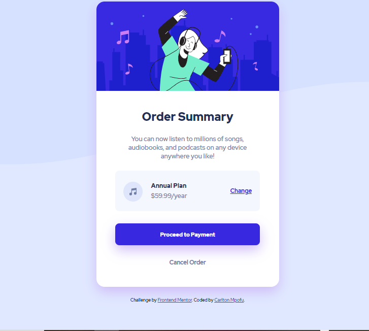

# Frontend Mentor - Order summary card solution

This is a solution to the [Order summary card challenge on Frontend Mentor](https://www.frontendmentor.io/challenges/order-summary-component-QlPmajDUj). Frontend Mentor challenges help you improve your coding skills by building realistic projects. 

## Table of contents

- [Overview](#overview)
  - [The challenge](#the-challenge)
  - [Screenshot](#screenshot)
  - [Links](#links)
- [My process](#my-process)
  - [Built with](#built-with)
  - [What I learned](#what-i-learned)
  - [Continued development](#continued-development)
  - [Useful resources](#useful-resources)
- [Author](#author)

## Overview

### The challenge

Users should be able to:

- See hover states for interactive elements

### Screenshot

### Links

- Solution URL: [carltonmpofu.frontendmentor.io](https://www.frontendmentor.io/solutions/responsive-order-summary-component-oTsTXxpq2)
- Live Site URL: [carltonmpofu.github.io](https://carltonmpofu.github.io/order-summary-component/)

## My process

### Built with

- HTML5 
- CSS custom properties

### What I learned

I used this project to practice the CSS and HTML concepts I've learned so far.I looked 
forward to using the position and float CSS properties to get the desired structure.

I also learned how to use the box-shadow css property. And how to get a background image
to fill the entire browser window.

### Continued development

I am going to continue doing more challenges to improve my HTML and CSS skills further.

### Useful resources

- [MDN Web Docs](https://developer.mozilla.org/en-US/docs/Web/CSS/box-shadow) - Helped me 
learn how to use the box-shadow CSS property

## Author

- Frontend Mentor - [@CarltonMpofu](https://www.frontendmentor.io/profile/CarltonMpofu)
